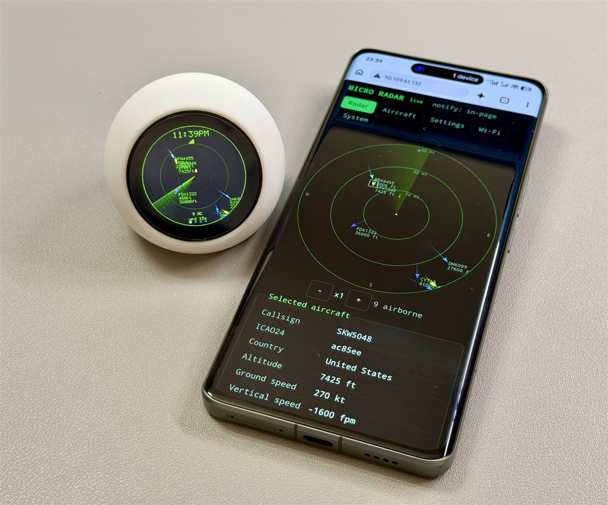

# AeroScope

<p align="center">
  
</p>

A live flight radar for the **Spotpear SP-ESP32-S3-1.28-BOX** (the round 1.28" "Xiaozhi" board). It shows nearby aircraft from [OpenSky Network](https://opensky-network.org/) on the 240×240 GC9A01 touch screen, and adds a live web dashboard, touch pages, sound alerts and a hardware self-test.

AeroScope is an ESP-IDF rewrite of [micro-radar](https://github.com/AnthonySturdy/micro-radar) by Anthony Sturdy (MIT). The full feature list is in [`FEATURES.md`](FEATURES.md).

## Hardware

- Spotpear SP-ESP32-S3-1.28-BOX: ESP32-S3, 16 MB flash, 8 MB octal PSRAM, GC9A01 LCD, CST816D touch, ES8311 codec with speaker and microphone.
- A 2.4 GHz Wi-Fi network.
- Optional: an [OpenSky API client](https://opensky-network.org/) (client ID + secret). Without one the device runs anonymously with a smaller daily request budget (about one update every 3.6 min instead of every 21.6 s).

## Using it

1. **Setup:** on first boot the device opens the Wi-Fi hotspot `AeroScope-Setup`. Scan the QR code on the screen, or join it and open `http://192.168.4.1`. Pick a 2.4 GHz network and save.
2. **Connected screen:** shows the network name, the IP and a QR code for the dashboard, for 8 s.
3. **Location:** open the dashboard and set your latitude and longitude under Settings → Location. Optionally add OpenSky credentials under Settings → OpenSky.
4. **Dashboard:** `http://aeroscope.local` or the device IP. It is self-contained and works without internet on the phone. Tabs:
   - **Radar:** live radar. Zoom with the buttons; click an aircraft for details.
   - **Aircraft:** sortable live table.
   - **Settings:** every option, grouped; "restart" marks the ones that need a reboot.
   - **Wi-Fi:** saved networks, scan, add, forget.
   - **System:** device info, live log, sound previews, self-test, backup/restore, reboot/reset.
5. **On the device:** swipe left/right between the pages:

   | Page | What it shows |
   |---|---|
   | **Radar** | the radar itself |
   | **Nearby** | aircraft nearest first; tap one for details |
   | **Details** | the selected aircraft, or the nearest |
   | **System** | IP, status, dashboard QR code, Self-test button |

   Touch on the radar page:

   | Gesture | Action |
   |---|---|
   | Tap the middle | brightness 25 → 50 → 75 → 100 % |
   | Tap near the outer ring, or swipe up | zoom in (×1/2/4/8) |
   | Swipe down | zoom out |
   | Double-tap | reset the view |

   Each gesture can be turned off in Settings → Touch.
6. **Alerts:** emergency squawks (7500/7600/7700) and watchlist aircraft play a sound, show a banner on the LCD (tap to dismiss), and show a banner with a beep on open dashboard pages.

## Build

Requires [ESP-IDF](https://docs.espressif.com/projects/esp-idf/) v6.1. Managed components are fetched automatically on the first build.

```sh
idf.py build
```

Components: esp_lcd_gc9a01 2.0.4, mdns 1.13.1, cjson 1.7.19, qrcode 0.2.0, esp_lvgl_port 2.9.0, lvgl 9.3.0, esp_codec_dev 1.6.2.

### Tests

The pure logic (pacing, colours, units, settings validation, alerts) is covered by host unit tests. Both scripts run in Docker:

```sh
sh test/run_host_tests.sh   # g++ on alpine
sh test/check_web.sh        # JS syntax check of main/web/app.html (node)
```

## Flash

Replace `PORT` with your serial port (e.g. `COM3` or `/dev/ttyACM0`).

**Full flash** (bootloader + partition table + otadata + app; NVS untouched):

```sh
python -m esptool --chip esp32s3 --port PORT -b 460800 --before default-reset --after watchdog-reset \
  write-flash --flash-mode dio --flash-freq 80m --flash-size 16MB \
  0x0 build/bootloader/bootloader.bin 0x8000 build/partition_table/partition-table.bin \
  0xe000 build/ota_data_initial.bin 0x10000 build/aeroscope.bin
```

**App only:**

```sh
python -m esptool --chip esp32s3 --port PORT -b 460800 --before default-reset --after watchdog-reset \
  write-flash 0x10000 build/aeroscope.bin
```

- Use `--after watchdog-reset`: a plain hard reset leaves this board in download mode.
- The USB serial port disappears briefly on every reset. Retry if esptool says the port doesn't exist.
- `idf.py -p PORT flash monitor` also works.

## Architecture

```
app_main: power latch -> log capture -> NVS (+ pending reset) -> settings -> LCD/backlight
          -> splash -> Wi-Fi (saved networks / setup portal) -> NTP -> connected screen
          -> web server + mDNS -> OpenSky + fetch task -> LVGL UI -> audio / alerts / self-test

fetch     core 0 prio 4  OpenSky every 21.6 s / budget-paced, 429-aware
render    core 1 prio 3  radar frame -> LVGL canvas (double buffer), only while the radar page shows
LVGL      core 1 prio 4  esp_lvgl_port task: pages, touch input (CST816D polled), flush to GC9A01
web_push  core 0 prio 3  WebSocket: aircraft 1 Hz, status 5 s, log lines, alerts
alerts    core 0 prio 2  emergency / watchlist detection every 2 s
audio     core 0 prio 3  sound queue (PA on only while playing)
```

- **Settings:** one schema (`main/settings.cpp`), stored as strings in NVS namespace `config`. The keys are compatible with the original micro-radar firmware.
- **Saved Wi-Fi networks:** NVS `wifi`/`list` (up to 8).
- **Partition table:** matches the Arduino `default_16MB.csv` layout, so switching from an Arduino build keeps NVS.

| File | Role |
|---|---|
| `main.cpp` | boot sequence, render + supervisor loops |
| `board.*` | power latch, backlight, GC9A01 (esp_lcd) |
| `gfx.*`, `font5x7.h` | RGB565 software canvas |
| `radar_view.*` | radar frame: sweep, rings, POIs, trails, icons, labels, overlays |
| `radar_logic.h`, `units.h` | pure logic: colours, pacing, shapes, units (host-tested) |
| `aircraft.*` | tracking, prediction, trails, fetch loop, snapshots |
| `opensky.*` | HTTPS + CA bundle, OAuth token, rate-limit headers, `extended=1` |
| `settings.*`, `config_store.*` | schema, validation, NVS |
| `net.*`, `captive_dns.*` | saved networks, static IP, setup hotspot, captive DNS |
| `web.*`, `web/app.html`, `web_pages.h` | dashboard, JSON API, WebSocket, setup portal |
| `ui.*`, `touch.*` | LVGL pages, gestures, banner, self-test view; CST816D |
| `audio.*`, `alerts.*`, `selftest.*` | ES8311 sounds; alert detection; hardware self-test |
| `timekeeping.*`, `sysinfo.*`, `logbuf.*`, `maintenance.*` | NTP/TZ; reset reason + core dump + log level; web log capture; deferred resets |
| `screens.*` | direct-flush boot screens with QR codes |

## Web API

All endpoints are JSON.

| Method | Path | Purpose |
|---|---|---|
| GET | `/api/aircraft` | `{centre, radius, list:[{i icao, c callsign, la, lo, a alt m, v m/s, h track, vr, cat, sq, g ground, d km, b bearing, age ms}]}` |
| GET | `/api/status` | firmware, uptime, reset reason, crash, heap, Wi-Fi, time, data status |
| GET/POST | `/api/settings` | schema + values / `{key: value}` changes → `{ok, restart}` |
| GET | `/api/wifi`, `/api/wifi/scan` | current + saved networks / scan |
| POST | `/api/wifi/add`, `/api/wifi/forget` | `{ssid, password}` / `{ssid}` |
| GET | `/api/logs` | recent log lines |
| GET | `/api/alerts` | active alerts |
| POST | `/api/alerts/ack` | `{id}`, or `{}` for all |
| GET/POST | `/api/selftest` | results / start |
| POST | `/api/sound` | `{sound: chime\|watch\|emergency}` preview |
| POST | `/api/reboot` | reboot |
| POST | `/api/reset` | `{scope: settings\|wifi\|all}` (applied at next boot) |
| GET | `/api/backup[?secrets=1]` | backup download |
| POST | `/api/restore` | restore → restart |
| WS | `/ws` | `ac` / `st` / `log` / `alert` messages |

> **Security:** the API has no authentication and the dashboard is served over plain HTTP. Only run the device on a trusted network.

## Logging

Serial output is on the USB-Serial/JTAG port (`idf.py -p PORT monitor`). Tags: `NET`, `RADAR`, `OPENSKY`, `WEB`, `UI`, `TOUCH`, `AUDIO`, `ALERT`, `SELFTEST`, `TIME`, `SYS`, `SETTINGS`, `MAINT`. Change the level live in Settings → System → Log level; the same lines stream to the dashboard's System tab.

## Resetting

- **Settings / Wi-Fi / both:** dashboard System tab (the erase runs at the next boot).
- **From the command line:** `python -m esptool --chip esp32s3 --port PORT erase-region 0x9000 0x5000` erases NVS (all settings and saved networks).

## Known limitations

- Browser notifications need HTTPS, so dashboard alerts are an in-page banner, a beep and a flashing tab title while the page is open.
- Aircraft category icons rely on OpenSky's category field; many transponders report "no info" and get the default symbol.
- If OpenSky's login server is slow at boot, the first token request can hold the connected screen for ~15 s and the first update runs anonymously.

## License

MIT. See [`LICENSE`](LICENSE). Based on [micro-radar](https://github.com/AnthonySturdy/micro-radar) © Anthony Sturdy.
